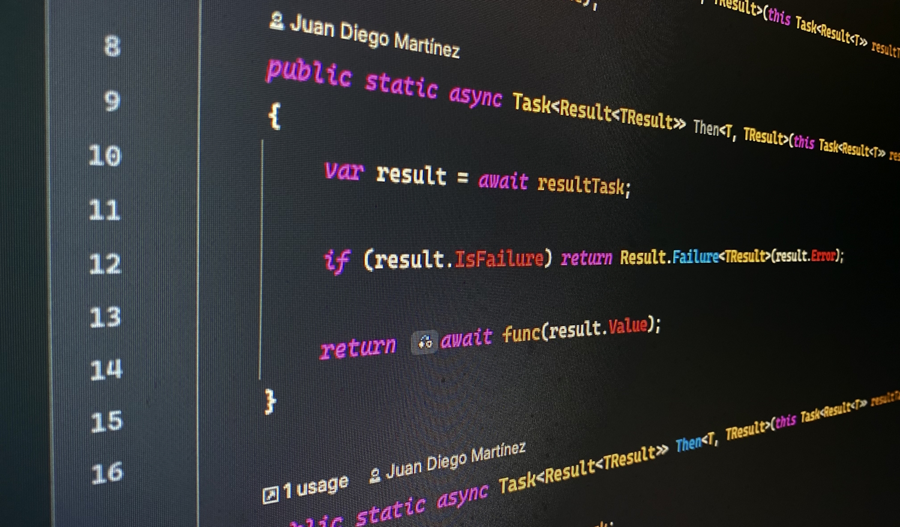

### Hey, there

I'm Juan and I'm a backend senior developer in SWAT 1 team at [Nextlane](https://github.com/Nextlane-R-D). I love building things using [C#](https://github.com/dotnet/csharplang) and learning new stuff every day.

## My job

- **I'm currently working on**: A lot of cloud use cases using microservices architecture, DDD, and some other exciting stuff.
- **Ask me about**: .NET, DDD, CQRS, RESTful APIs, SQL databases, software architecture, design datterns, desting, and more...
- **How to reach me**: Reach out and connect with me on Microsoft Teams.

## My hobbies

You can also check it out my [personal GitHub account](https://github.com/jdmartinez) where you can find other cool C# stuff, like: 

- **[Functional](https://github.com/jdmartinez/Functional)**. Nuget package with some functional types.
- **[Notion Movie Updater](https://github.com/jdmartinez/notion-movie-updater)**. A simple experiment about how to use GitHub Actions to schedule and running an application.

## Tools I use

<!--
**jdmartinez-nxl/jdmartinez-nxl** is a ✨ _special_ ✨ repository because its `README.md` (this file) appears on your GitHub profile.

Here are some ideas to get you started:

- 🔭 I’m currently working on ...
- 🌱 I’m currently learning ...
- 👯 I’m looking to collaborate on ...
- 🤔 I’m looking for help with ...
- 💬 Ask me about ...
- 📫 How to reach me: ...
- 😄 Pronouns: ...
- ⚡ Fun fact: ...
-->
